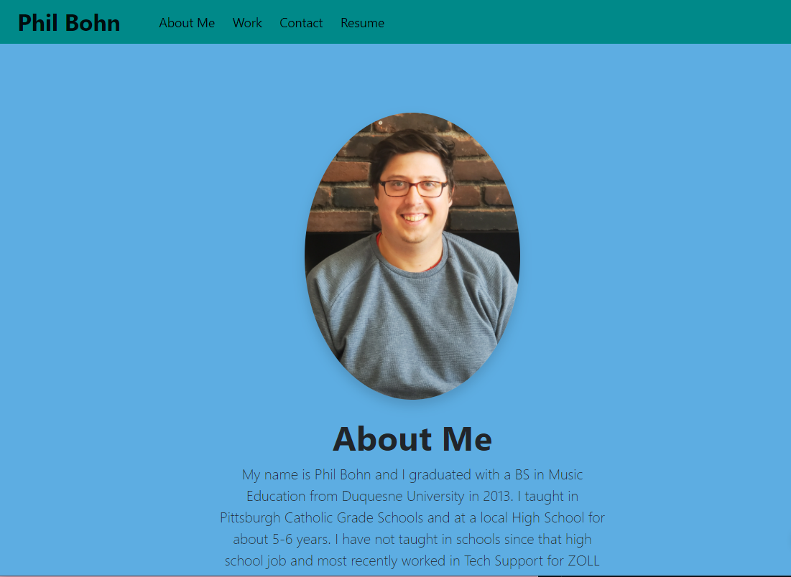

# React-Portfolio

## Description

This is a React-created portfolio to showcase skills and proficienies, provide links to my GitHub/LinkedIn/Email Address, and provide a home for my Resume to be seen and downloaded.

Here is a screenshot of the deployed app:

Here is a link to the deployed app: [GitHub Deployment](https://lamperouge1218.github.io/react-portfolio/)

## License

This project is protected under the [MIT](https://choosealicense.com/licenses/mit/) license. (2021) (Phil Bohn)

## Questions

If there any questions regarding this project, I can be contacted in the following places:

GitHub: [@lamperouge1218](https://github.com/lamperouge1218)

Email: philbohn1791@gmail.com
